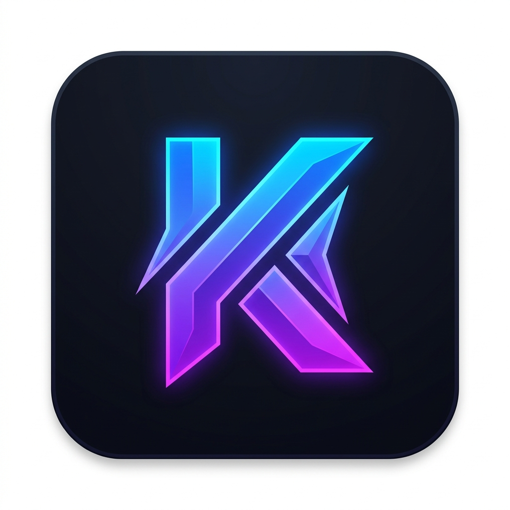

# <p align="center"><br>KURA — Game Discovery Platform 🎮</p>

<p align="center">
  
  
  
  
  
</p>

---

## 🌟 Tentang KURA

**KURA** adalah *Game Discovery Platform* modern dan premium yang dirancang khusus untuk memfasilitasi para gamer dalam menjelajahi, melacak, mengulas, dan mengoleksi berbagai video game favorit mereka. Terinspirasi oleh konsep *social journaling* seperti Letterboxd (untuk film) atau Backloggd (untuk game), KURA memadukan katalog eksternal yang melimpah dari **RAWG.io API** dengan data sosial dinamis yang disimpan secara real-time di **Firebase Firestore**.

Dengan antarmuka yang modern, dinamis, berbasis *dark-mode* elegan, serta dilengkapi micro-animation yang memanjakan mata, KURA menawarkan pengalaman premium bagi para pecinta video game untuk terhubung dan mendokumentasikan petualangan gaming mereka.

---

## ✨ Fitur Unggulan

### 🔍 1. Eksplorasi Katalog Komprehensif (RAWG.io API)
- Jelajahi puluhan ribu judul game secara real-time.
- Informasi lengkap mencakup rating Metacritic, tanggal rilis, pengembang (developers), penerbit (publishers), platform (PC, konsol, mobile), genre, screenshot in-game, tag komunitas, hingga rata-rata waktu bermain (playtime).
- Pencarian dan filter game yang responsif serta cerdas.

### 📚 2. Pelacakan Library & Wishlist Pribadi
- **Library Tracker**: Tandai game yang Anda miliki berdasarkan status bermain:
  - 🎮 `playing` (Sedang Dimainkan)
  - 🏆 `beaten` (Tamat / Selesai)
  - 📥 `plan` (Rencana Dimainkan)
  - 🚫 `dropped` (Ditinggalkan)
- **Wishlist Personal**: Simpan game incaran masa depan Anda lengkap dengan kompilasi metadata game yang tersinkronisasi secara otomatis.

### 📂 3. Koleksi Game Bertema (Custom Collections)
- Buat koleksi game dengan tema kustom (misal: *"Game Souls-like Terbaik"*, *"Game Santai Pengusir Stres"*).
- Dilengkapi deskripsi khusus dan penghitung jumlah game otomatis (*atomically synced* menggunakan transaksi Firestore).

### 💬 4. Ulasan & Sistem Rating Komunitas
- **Ulasan Mendalam**: Tulis ulasan game (10 - 1000 karakter) dengan sistem penilaian 1-5 bintang.
- **Emoji Quick Ratings**: Berikan rating kilat secara visual melalui emoji ekspresif: *Exceptional* (Sangat Bagus), *Recommended* (Direkomendasikan), *Meh* (Biasa Saja), *Skip it* (Lewati), atau *Avoid* (Hindari).
- **Moderasi & Sensor**: Dilengkapi *profanity filter* (penyaring kata kasar) otomatis yang akan mengubah status ulasan baru menjadi `pending` jika terdeteksi melanggar untuk ditinjau oleh Admin.
- **Interaksi Sosial**: Berikan apresiasi berupa *Like* pada ulasan pengguna lain atau ajukan laporan (*Report*) terhadap ulasan yang melanggar ketentuan.

### 🌐 5. Feed Aktivitas Sosial & Profil Gamer
- **Aktivitas Beranda**: Ikuti aktivitas gaming terbaru dari komunitas melalui feed aktivitas dinamis (`activities`) yang mencatat ulasan baru, rating, game yang baru ditambah ke library, wishlist, dan koleksi.
- **Sistem Follow**: Ikuti akun gamer lain untuk melihat update mereka secara personal di beranda Anda.
- **Gaming Social Link**: Hubungkan profil game eksternal Anda seperti Steam, PlayStation Network, Xbox Gamertag, Epic Games, GOG, Battle.net, dan Nintendo Friend Code langsung di halaman pengaturan profil.

### 🛠️ 6. Dashboard Admin Terpadu & SEO Manager
- **Moderasi Laporan**: Panel khusus untuk meninjau laporan ulasan bermasalah dengan aksi penghapusan ulasan atau penolakan laporan.
- **Curation Engine**: Ubah banner kurasi utama di beranda secara langsung dengan memasukkan ID Game pilihan untuk dipamerkan kepada seluruh pengguna.
- **Announcement Manager**: Publikasikan pengumuman global dengan tipe info, peringatan, atau sukses secara real-time yang akan muncul sebagai banner di bagian atas aplikasi.
- **SEO Manager**: Modifikasi judul situs, meta deskripsi, dan kata kunci global langsung dari dashboard untuk optimasi mesin pencari secara dinamis.
- **User Ban Management**: Blokir sementara pengguna yang melanggar agar tidak dapat mengirim ulasan baru di platform.
- **Immutable Audit Logs**: Riwayat lengkap tindakan admin yang tercatat secara permanen tanpa dapat diubah demi transparansi tata kelola platform.

---

## 🛠️ Stack Teknologi

KURA dikembangkan menggunakan teknologi mutakhir untuk memastikan performa yang cepat, interaksi yang mulus, dan arsitektur yang mudah dirawat:

* **Framework Core:** [Next.js v16.1 (App Router)](https://nextjs.org/) & [React v19.2](https://react.dev/)
* **Bahasa:** [TypeScript](https://www.typescriptlang.org/)
* **Styling & Animasi:** [Tailwind CSS v4.0](https://tailwindcss.com/) (menggunakan skema tema variabel modern & efek transisi premium) dan [Framer Motion v12](https://www.framer.com/motion/) untuk micro-interactions yang mulus.
* **Database & Auth:** [Firebase v12.10 (Firestore & Authentication & Storage)](https://firebase.google.com/)
* **State Management & Fetching:** [TanStack React Query v5](https://tanstack.com/query/latest) & [Axios](https://axios-http.com/)
* **Komponen UI:** [Base UI](https://base-ui.com/) & [Lucide Icons](https://lucide.dev/)
* **Visualisasi Data:** [Recharts](https://recharts.org/) untuk menyajikan visualisasi statistik rating game.

---

## 📂 Struktur Direktori Proyek

```bash
KURA/
├── public/                 # Aset statis & logo aplikasi
├── src/
│   ├── app/                # Next.js App Router (Halaman & Routing Utama)
│   │   ├── admin/          # Panel Dashboard Admin (Kurasi, Pengumuman, Laporan, SEO)
│   │   ├── collections/    # Halaman Pengelolaan Koleksi Game
│   │   ├── community/      # Halaman Feed Aktivitas Sosial Komunitas
│   │   ├── docs/           # Dokumentasi Platform
│   │   ├── library/        # Halaman Library Game Pengguna
│   │   ├── profile/        # Halaman Profil Gamer & Sosial Link
│   │   ├── settings/       # Pengaturan Profil, Notifikasi, & Akun
│   │   ├── wishlist/       # Daftar Game Wishlist Pengguna
│   │   └── globals.css     # Tailwind CSS v4 Global Configurations
│   ├── components/         # Komponen UI Reusable
│   │   ├── ui/             # Komponen UI Atomik / Dasar
│   │   ├── ActivityFeed.tsx# Komponen Feed Sosial Aktivitas
│   │   ├── GameCard.tsx    # Kartu Visual Game dengan Hover Animation
│   │   └── Navbar & Sidebar# Navigasi Aplikasi Modern & Responsif
│   ├── contexts/           # React Context (Platform Config, Global State)
│   ├── hooks/              # Custom React Hooks (useGames, useDebounce)
│   ├── lib/                # Konfigurasi & Utility Inti (Firebase, Admin, Logging)
│   │   ├── firebase.ts     # Inisialisasi Firebase Client
│   │   ├── auditLogger.ts  # Pencatatan Immutable Audit Log Admin
│   │   └── activityLogger.ts# Pencatatan Aktivitas Pengguna ke Firestore
│   └── services/           # Service Handler (RAWG API Integration)
│       └── api.ts          # Integrasi Axios untuk RAWG API
├── firestore.rules         # Aturan Keamanan Database Firestore
├── kura_erd.dbml           # Entity Relationship Diagram (ERD) Komplit
└── package.json            # Daftar Dependencies & Skrip Proyek
```

---

## 🗄️ Model Data (Firestore & RAWG API)

KURA memadukan database lokal Firestore untuk menyimpan data dinamis pengguna dengan data eksternal dari RAWG API. Model database lengkap dapat dilihat pada file [kura_erd.dbml](file:///home/hp/Documents/KURA/kura_erd.dbml) yang kompatibel dengan [dbdiagram.io](https://dbdiagram.io).

### Struktur Koleksi Utama Firestore:
1. **`users`**: Profil lengkap pengguna, tautan game eksternal (Steam, PSN, Xbox, dsb), konfigurasi notifikasi, dan status ban.
2. **`follows`**: Relasi banyak-ke-banyak pengikut antar pengguna.
3. **`library`**: Menyimpan status bermain game milik pengguna (`playing`, `beaten`, `dropped`, `plan`).
4. **`wishlists`**: Menyimpan daftar game incaran pengguna dengan data game yang didenormalisasi.
5. **`collections` & `collection_games`**: Menyimpan folder koleksi kustom beserta daftar game di dalamnya.
6. **`reviews`**: Ulasan tertulis pengguna, skor bintang, jumlah like, dan status moderasi.
7. **`reports`**: Laporan ulasan bermasalah untuk moderasi admin.
8. **`gameRatings`**: Rating instan per game dengan emoji quick rating (mencegah duplikasi menggunakan composite ID `{userId}_{gameId}`).
9. **`activities`**: Log aktivitas sosial pengguna untuk menyusun Feed Komunitas.
10. **`audit_logs`**: Log audit atas tindakan administrasi (banned user, pengumuman, dsb) secara aman dan transparan.
11. **`settings/global_config`**: Konfigurasi pesan pengumuman global.
12. **`settings/curation_config`**: Konfigurasi game unggulan di homepage.
13. **`settings/seo_config`**: Konfigurasi template SEO situs secara real-time.

---

## 🚀 Langkah Instalasi & Konfigurasi Lokal

Untuk menjalankan proyek KURA di komputer lokal Anda, ikuti langkah-langkah di bawah ini:

### 1. Prasyarat (Prerequisites)
Pastikan Anda sudah menginstal:
* [Node.js](https://nodejs.org/) (Sangat direkomendasikan versi LTS 18.x atau lebih baru)
* [npm](https://www.npmjs.com/) atau [Yarn](https://yarnpkg.com/)

### 2. Kloning Repositori & Masuk ke Direktori
```bash
git clone <url-repositori-anda>
cd KURA
```

### 3. Instalasi Dependensi
Jalankan perintah berikut untuk mengunduh semua package yang dibutuhkan:
```bash
npm install
```

### 4. Konfigurasi Environment Variables
Buat berkas baru bernama `.env.local` pada direktori utama proyek, kemudian isi dengan konfigurasi berikut (silakan sesuaikan dengan kredensial Firebase dan RAWG API Anda):

```env
# ---------------------
# RAWG API Configuration
# ---------------------
# Dapatkan API Key Anda di https://rawg.io/apidocs
NEXT_PUBLIC_RAWG_API_KEY=isi_dengan_api_key_rawg_anda

# -------------------------
# Firebase Configuration
# -------------------------
# Dapatkan kredensial ini di Firebase Console (Project Settings > General > Web App)
NEXT_PUBLIC_FIREBASE_API_KEY=isi_dengan_firebase_api_key_anda
NEXT_PUBLIC_FIREBASE_AUTH_DOMAIN=nama-proyek-anda.firebaseapp.com
NEXT_PUBLIC_FIREBASE_PROJECT_ID=nama-proyek-anda
NEXT_PUBLIC_FIREBASE_STORAGE_BUCKET=nama-proyek-anda.firebasestorage.app
NEXT_PUBLIC_FIREBASE_MESSAGING_SENDER_ID=nomor_sender_id_firebase_anda
NEXT_PUBLIC_FIREBASE_APP_ID=1:nomor_sender:web:id_app_firebase_anda

# -------------------------
# Admin Configuration (Opsional)
# -------------------------
# Konfigurasikan email dan UID akun Anda yang ingin dijadikan sebagai Super Admin
NEXT_PUBLIC_ADMIN_EMAIL=admin@kura.com
NEXT_PUBLIC_ADMIN_UID=id_uid_firebase_auth_admin_anda
```

### 5. Menjalankan Server Pengembangan (Local Dev Server)
Jalankan perintah berikut untuk memulai server lokal:
```bash
npm run dev
```
Setelah berhasil, buka peramban Anda dan akses **[http://localhost:3000](http://localhost:3000)**.

### 6. Membangun untuk Produksi (Build for Production)
Untuk memvalidasi dan membuild aplikasi Anda ke mode siap produksi, jalankan:
```bash
npm run build
npm run start
```

---

## 🔒 Aturan Keamanan Database (Firestore Rules)
Pastikan Anda menerapkan berkas [firestore.rules](file:///home/hp/Documents/KURA/firestore.rules) ke Firebase Console Anda demi menjaga keamanan data pengguna dari manipulasi pihak luar yang tidak bertanggung jawab. Aturan ini memastikan:
* Hanya pengguna terautentikasi yang dapat menulis data mereka sendiri.
* Hanya admin terdaftar (`NEXT_PUBLIC_ADMIN_UID`) yang memiliki hak akses penuh ke panel laporan, audit logs, dan setelan konfigurasi global.
* Ulasan dan data sosial dapat dibaca secara publik untuk menciptakan pengalaman komunitas terbuka.

---

## 🤝 Kontribusi

Kontribusi selalu diterima dengan tangan terbuka! Jika Anda memiliki ide perbaikan, penambahan fitur, atau menemukan bug, silakan buat *Pull Request* atau laporkan via *Issues*. 

Mari bersama-sama menjadikan **KURA** tempat terbaik bagi seluruh gamer di dunia untuk mendokumentasikan kecintaan mereka pada video game! 💙
